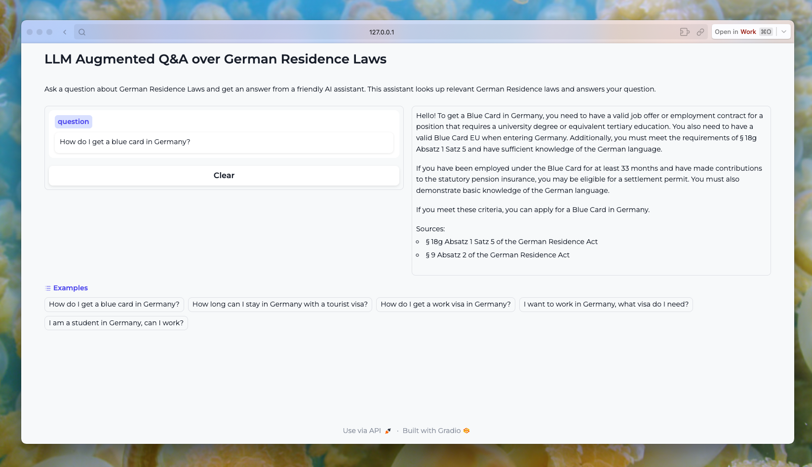

## About Me

My goal in learning about and working with LLMs is to create tools that facilitate easier, more affordable, faster, and more accurate access to knowledge. By empowering individuals with tools to navigate through the complexities of information, especially in areas where it is traditionally expensive or convoluted, I aim to make information clear, accessible, and understandable for all.

Feel free to reach out! 😁

- **LinkedIn:** [Send me a message on LinkedIn](http://linkedin.com/in/ingridwstevens/)
- **Medium:** [Read my latest stories about LLMs on Medium](https://medium.com/@ingridwickstevens)

## Skills Snapshot 🛠️
- **Data:** Python, Pandas, NumPy, NLP, Jupyter, Git, Tableau, SQL, Streamlit, LangChain
- **Languages:** English (Native), German (B2)

## Projects
I'm always building something! 

### Not A Lawyer: Chat with Legal Documents with Retrieval Augmented Generation

Chat with legal documents using OpenAI's API and Pinecone as vectorstore. This project builds a legal chatbot with knowledge about the German residency law.

[Check out the project](https://github.com/ingridstevens/lawyer)

### RAG over Audio (OpenAI Whisper API)

Using OpenAI's Whisper API, LangChain's RecursiveCharacterTextSplitter, and Ollama Embeddings, this notebook converts audio to text, tokenizes it, and generates embeddings. Now you can ask questions directly of your audio files.

[Check out the project](https://github.com/ingridstevens/whisper-audio-transcriber/tree/main)

### Local LLM Chat

Play around with your favorite open source models using Streamlit. This app uses LangChain’s Ollama integration + buffer memory. Configurable to any local model, this app brings a clean interface and local LLM chats straight to your fingertips.

[Chat locally](https://github.com/ingridstevens/local-model-chat)
